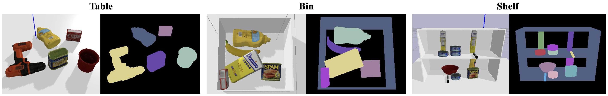
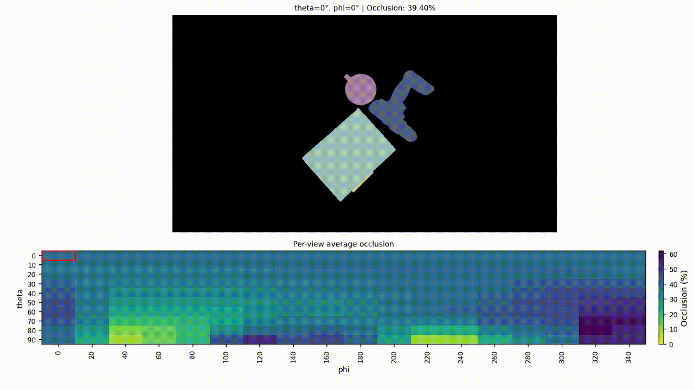
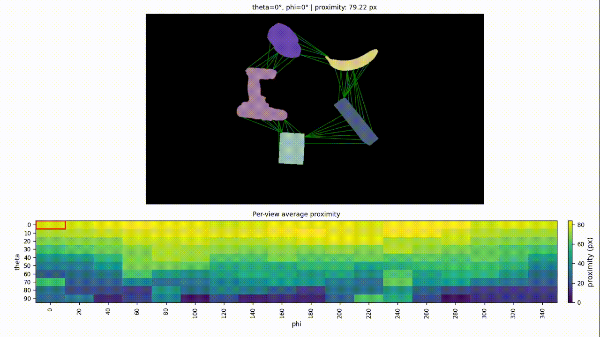
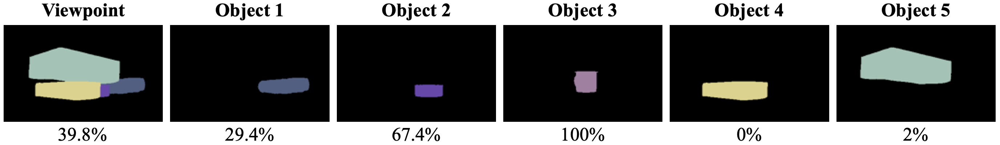
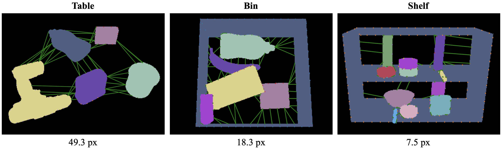

# Clutter Metrics to Evaluate Multi-Object Scenes for Benchmarking Robotic Grasping and Manipulation


Below are the ordered instructions on how to generate scenes and there corresponding ground truth segmentation masks that we use to evaluate each scene. 

```bash
git clone https://github.com/JohnBrann/clutter_metrics
cd clutter_metrics
```

Through this repository you can create and evaluate the following type of scenes



## Example Scenes
Provided in this repository are two example scenes one is able to visualize using the visualization UI instructed below. The visualization UI shows the Occlusion or Proximity for each viewpoint of that scene.


### Occlusion UI

```bash
cd clutter_metrics
python3 scripts/occlusion_visualization_ui.py --dataset-name 298
```



### Proximity UI

```bash
cd clutter_metrics
python3 scripts/proximity_visualization_ui.py --dataset-name 22
```



## Creating New Scenes
Instructions on how to create new scenes, load ManipulationNet scnenes, and acquire the data required for our metrics are explained below

### Docker Setup
To make it easier to run these metrics we provided a docker setup. This is especially helpful for using the PyBullet Simulators to create scenes and collect data.

```
cd data_collection
cd docker
```

Build the docker image if you have not already done so:
```
docker build -t clutter_metrics:latest .
```

Run the docker container:
```
./run_data_collection_docker.sh
```

Once inside the docker container, activate the conda environment:
```
conda activate clutter-metrics
```

You should now be able to proceed with generating scenes in the section below.


## Generate Cluttered Scenes and Segmentation Masks:
This script creates a cluttered scene of objects on a platform in pybullet inspired by the creators of [VGN](https://github.com/ethz-asl/vgn). From this scene we collect segmentation masks from multiple viewpoints around the scene to get a 3D representation from 2D viewpoints. Azimuth and Theta degrees are used to specify how many viewpoints around and above the scene respectfully. Lower values create more in detailed scene representations. By defualt, 180 viewpoints are capture around the scene.

```
cd data_collection
python3 create_scene.py --scene pile --object-set <object_set> --remove-box
```
- Exclude "--remove-box" to have the bin persist throughout the collection process.
- Include "--sim-gui" and "--idle-after" to see the collection process. This will slow down the collection process.
- The example object set used 16 objects from the YCB dataset. Create your own object set in the object_set folder following the same format as the objects in "object_sets/ycb".


```
python3 create_scene.py --scene pile --object-set ycb --remove-box

```


We also have the capability of reproducing scenes used in the [ManipulationNet Grasping In Clutter Benchmarking Task](https://manipulation-net.org/tasks/grasping_in_clutter.html)

```
python3 create_scene.py --scene replica --replica-scene-id 22 --object-set ycb --remove-box
```

There are 4 types of scenes that one can create: 
- pile (objects are dropped from a height onto workspace)
- packed (objects are places on the workspace and removed if any object touches)
- shelf (objects are placed on a shelf (poses and objects are currently pre-determined))
- replica (uses a scene from ManipulationNet (*make sure to include --replica-scene-id <scene_number>))


After running the simulation you should get a resulting .npz file which we use to create our segmentation mask images. 

To visualize the images, run the following:
```
python3 visualize_npy.py --scene <dataset_name> 
```

Now you have the ground truth scene and single object segmentations masks. 


## Evaluation Metrics  
From these segmentation masks generated above we are able to quantify each scene in a few methods. An occlusion metric and a proximity metric

For the example scenes, this is already done, but if you generate a new scene, you can apply this metric to that. 

### Occlusion
Occlusion represents the ratio between an object's ground-truth segmentation (as if all other objects in the scene were invisible) and its actual visible area from the given viewpoint. An object that is only 30% visible from a given viewpoint would be considered 70% occluded. Here is an example calculation from a single viewpoint:




```  
cd ..
python3 scripts/calculate_occlusion.py --dataset_name <dataset_name>
```

This script computes the occlusion score for each object as well as the average occlusion for the entire viewpoint.
The dataset name is the name of the object_set used for that scene. 


### Proximity
We have also began exploring some proximity metrics from these segmentation masks. Objects that are closer together are generally harder to grasp we assume these scenes would be more cluttered compared to scenes with objects more spread apart.

Here is an example calculation from a single viewpoint for some various scene types:




Run the script to draw connection points from objects in each viewpoint
```
python3 scripts/calculate_proximity.py --dataset-name <dataset_name>    --occlusion-threshold 50.0
```

Notice we filter out objects that are above a certain occlusion threshold, We did this to make clearer connections between objects. We also believe objects above a certain occlusion threshold are ungraspable and the inclusion of them is not valuable.
