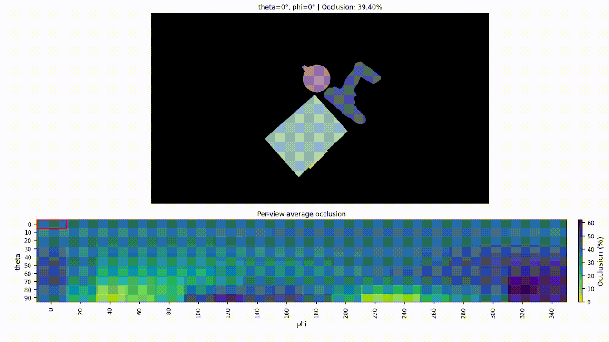
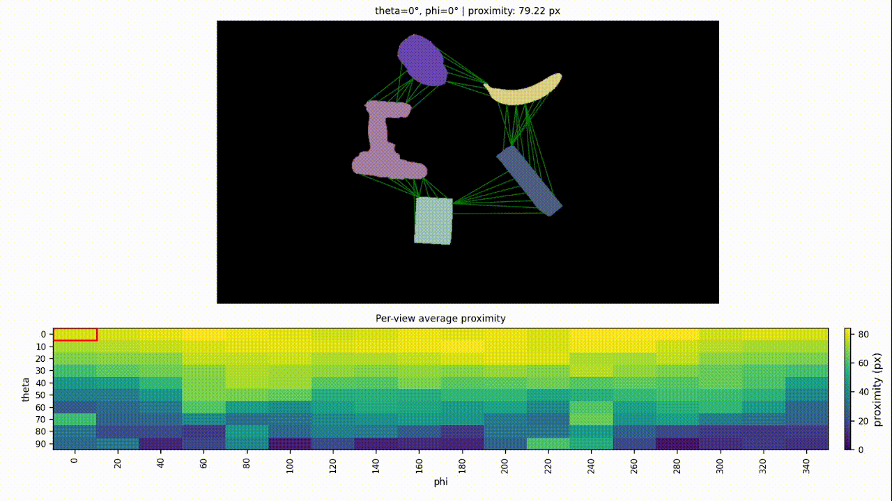

# Clutter Metrics to Evaluate Multi-Object Scenes for Benchmarking Robotic Grasping and Manipulation


Below are the ordered instructions on how to generate scenes and there corresponding ground truth segmentation masks that we use to evaluate each scene. 

```bash
git clone https://github.com/JohnBrann/clutter_metrics
cd clutter_metrics
```
## Requirements

Install the required python packages
```
pip install numpy pillow matplotlib scipy opencv-python pyyaml pybullet

```

A work in progress Docker setup is provided at the bottom of this README


## Creating New Scenes

Instructions on how to use new object sets and create new scenes are provided below.

### Object Set Format

You can use your own objects for cluttered scene creation by adding a new object folder inside `/object_sets`. The current supported file formats are `.urdf` and `.obj`. An example of the expected structure is shown below.

```
clutter_metrics/
└── data_collection/
    └── object_sets/
        └── atb1_objects/ # Name of object_set
            └── atb1_gear-large/ # Object in object_Set
                └── fused/
                    ├── atb1_gear-large.urdf
                    └── obj/
                        ├── baked_texture.png
                        ├── fused_model.mtl
                        └── fused_model.obj
```

For ready-to-use objects, use the [MOADv2 Dataset access point](https://github.com/pgavriel/MOADv2) to download objects. Make sure to generate URDF files as instructed in the that README. Or use a portion of YCB objects provided in object_sets.

Once the object set is set up, reference the folder name as the desired object set in `/clutter_metrics/data_collection/config/scene_config.yaml` under `object_set`. Also make sure to specify which objects from that object_set that can be used under "list_of_objects".

### Generating and Evaluating Scenes

To simplify the full evaluation process, we provide a ready-to-use script that creates a scene, generates the required segmentation data, and evaluates it using both metrics.

```bash
cd scripts
chmod +x generate_and_eval_scenes.sh
./generate_and_eval_scenes.sh batch1 10
```

**Usage:**
```
./generate_and_eval_scenes.sh <scene_prefix> <number_of_scenes_to_generate>
```

For more per-scene specifications (e.g. how many objects in a scene, allow duplicate objects in a scene), reference '/clutter_metrics/data_collection/config/scene_config.yaml'.


## User Interfaces
We developed 3 user interfaces that can be used to help understand generated cluttered scenes. 2 of them used for visualization and understanding of a scenes and its corresponding metrics, and one for organizing many generated scenes. 


### Occlusion UI
Visualize per-viewpoint avg. occlusion 

```bash
cd clutter_metrics
python3 scripts/occlusion_visualization_ui.py --dataset-name 298
```



### Proximity UI
Visualize per-viewpoint avg. proximity 

```bash
cd clutter_metrics
python3 scripts/proximity_visualization_ui.py --dataset-name 22
```




### Multiple Scene UI
Visualize and sort through many scenes at once
```bash
cd scene_viewer
python3 server.py
```

## Docker Setup
### (this needs to be updated and may not work in the current state of the repo)

To make it easier to run these metrics we provided a docker setup. This is especially helpful for using the PyBullet Simulators to create scenes and collect data.

```
cd data_collection
cd docker
```

Build the docker image if you have not already done so:
```
docker build -t clutter_metrics:latest .
```

Run the docker container:
```
./run_data_collection_docker.sh
```

Once inside the docker container, activate the conda environment:
```
conda activate clutter-metrics
```

You should now be able to proceed with generating scenes in the section below.